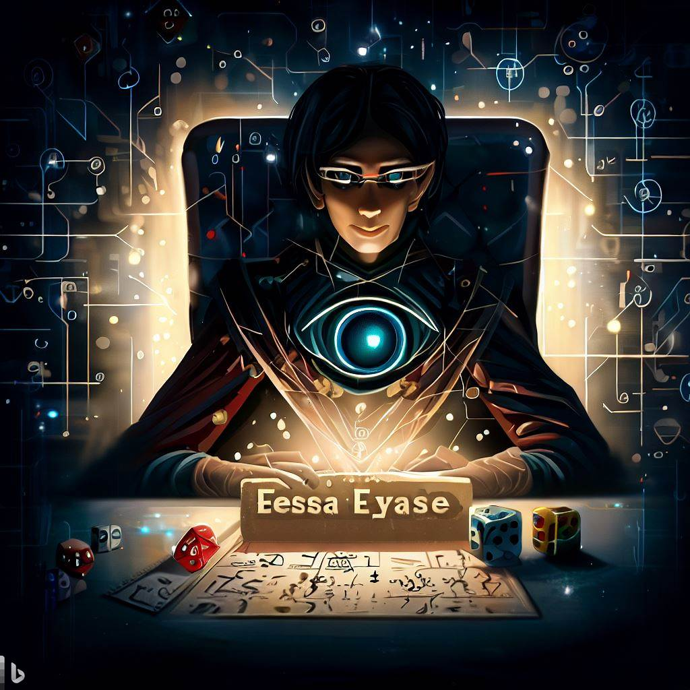
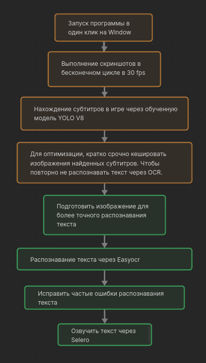

# EyeEaseAI: Intelligent Game Subtitle Reader

## Ввод в курс дела

Прими за аксиому, что озвучка субтитров нужна. Почему? Чтение субтитров в играх не просто неудобно — это настоящее испытание для глаз, особенно для тех, кто проводит перед монитором большую часть дня, например, программистов. После 9 часов чтения кода дополнительная нагрузка на глаза в виде чтения субтитров в играх кажется избыточной.

**Зачем нужна эта программа?** Представьте, что после утомительного рабочего дня вы решаете отдохнуть и погрузиться в мир любимой игры, но субтитры на экране мешают вам насладиться игровым процессом. EyeEaseAI создана для того, чтобы избавить вас от необходимости самостоятельно читать субтитры и нагружать глаза. Она позволяет углубиться в игру, не отвлекаясь на чтение текста.

**Что с озвучкой на разных языках?** Озвучка людьми занимает долгое время, до 1-2 лет, а иногда и больше. Проекты от компаний вроде Rockstar, такие как GTA 5, могут оставаться неозвученными на определенных языках спустя даже 10 лет.

**Альтернативные решения?** Существует программа Dictor Dialog, но её главный недостаток в использовании стороннего сервиса для озвучки — Яндекс, из-за чего она не может быть полностью бесплатной и автономной. Наша программа EyeEaseAI не сталкивается с этой проблемой.

**Состояние проекта.** EyeEaseAI ещё на стадии разработки, и нам нужно время, а также советы и поддержка сообщества, чтобы создать наилучший продукт.

**Open Source и участие сообщества.** Ни одна корпорация в мире до сих пор не решилась на AI озвучку субтитров в играх, поэтому такая программа может быть создана только в формате open source. EyeEaseAI — это open source проект, и каждый может принять участие в его улучшении.

**Поддержка разных языков.** EyeEaseAI будет работать не только с русскими субтитрами, но и с другими языками, такими как казахский, польский, турецкий, монгольский и многие другие.

Помощь сообщества программистов неоценима в таком сложном и масштабном проекте. Присоединяйтесь к нам и давайте вместе сделаем игровой процесс более комфортным и погружающим!

## План реализации

-   Зеленое - сделано
-   Желтое - не сделано
